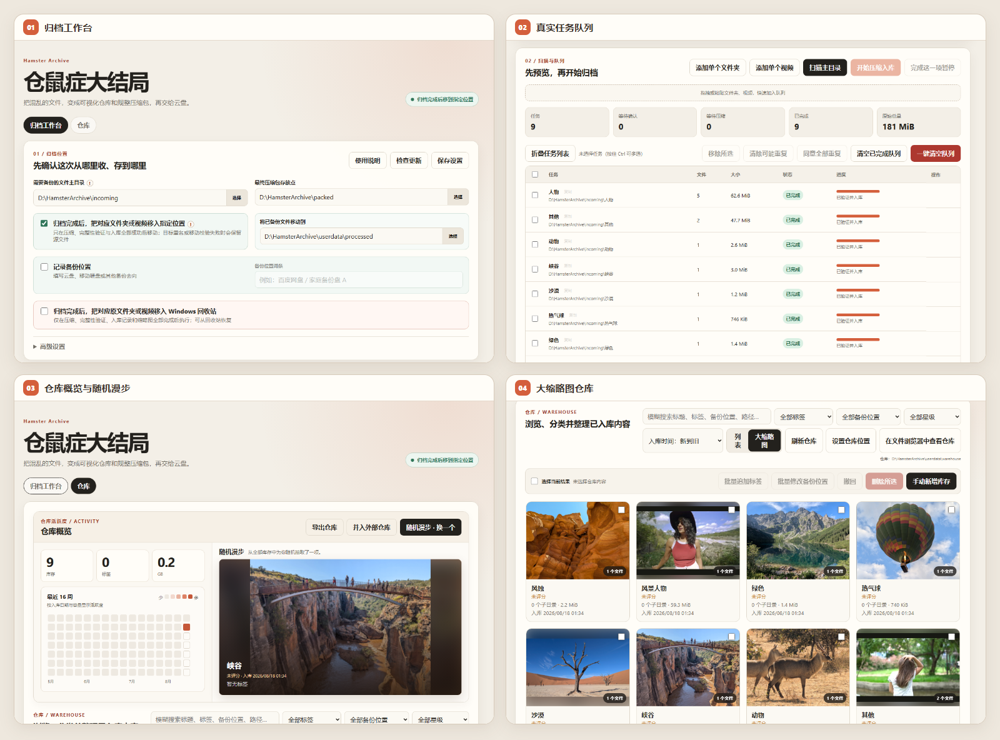

<div align="center">


# 仓鼠症大结局 Hamster Archiver

### 把散乱的大文件变成可校验的压缩包，也变成能搜索、能预览的本地仓库

Local-first batch archiver and searchable media vault for Windows.

本地优先 · 批量归档 · 媒体预览 · 便携数据


[](https://github.com/CarlosZ16420/hamster-archiver/actions/workflows/ci.yml)

[下载发行版](../../releases) · [报告问题](../../issues) · [参与贡献](CONTRIBUTING.md)

</div>

---

##  这是一个什么样的工具

如果你有以下困扰之一，那它就是为你做的：

- 📁 下载文件夹里堆了几个 TB 的视频和图片，**找起来像考古**
- 🔁 同一个资源**重复下载了 3 次才想起来**"好像已经存过了"
- 🗂 想整理，但**一打开文件夹就放弃了**
- 😰 备份到云盘，但**文件凌乱**，传上去就再也找不到
- 🔒 不想把私人媒体交给**云相册的 AI 扫描**

## 它做什么

把下载目录里堆成山的文件夹和视频，逐个压缩、校验、登记到一个可搜索的本地仓库。普通压缩工具只生成压缩包；Hamster Archiver 同时告诉你**里面是什么、放到了哪里、是否已经收过**。

```text
扫描 → 清单与查重 → 7-Zip（7z/ZIP）压缩 → 完整性验证 → 建立仓库记录 → 后处理原文件
```

- 主目录中的每个一级文件夹或视频，分别成为一个任务；也可直接拖入单项。
- 生成目录清单、**自动截取各类媒体缩略图**和信息，随后用 SQLite 建立本地索引。
- 可在 64 MiB—10 GiB 范围内设置单卷大小，默认 10 GiB；即使关闭主动分卷，超过 10 GiB 的任务仍会在确认后安全分卷。密码、备份位置、标签、星级和备注可随项目记录。
- 疑似重复、大任务和体积异常会停下来等待人工确认。
- 只有压缩、验证和入库完成后，才会按设置保留、移动或回收原文件。

## 界面一览




## 仓库

仓库不是一张压缩包清单。它提供封面浏览、活跃度统计和随机漫步。搜索覆盖标题、标签、备注、路径与文件名；列表分页按可视区域渲染，适合逐渐增长的库存。

项目中不仅包含了视频、图片的缩略截图，还包含完整的目录结构。每张图片都是缩略图，保存信息的同时也控制自身体积。

视频截取帧数、项目保存缩略图个数等参数均自由可调。

## 主要能力

### 安全归档

- 软件目录内置便携版 7-Zip，支持 7z/ZIP 格式、0—9 压缩等级与 `7z t` 完整性测试。
- 压缩前清单和源文件复核；无法读取的文件跳过并写入日志。
- 体积异常不自动入库，可确认保留或只删除异常成品。
- 多卷成品采用暂存隔离后的原子删除流程，避免只处理一部分分卷。
- 压缩前检查磁盘余量；跨盘移动采用复制、核验、再删除源文件。
- 队列支持暂停、完成当前项后暂停、定时运行和基于历史速度的剩余时间估算。

### 媒体与缩略图

- 便携版 FFmpeg 完成视频探测与均匀抽帧，无需 FFprobe。
- 视频帧数和单项目缩略图上限均可设置；竖屏画面完整保留。
- 同一视频的多帧预览会成组显示。
- 图片可放大、设为封面、删除，也可手动选择或粘贴补充图片。

### 搜索、重复与相似关系

- SQLite + FTS5 持久化索引，中文采用单字与 bigram 候选词，拉丁文字按词索引。
- 精确指纹、标题和视频大小参与重复提示；相似判断完全在本地完成。
- 相似关系可针对单个项目重新计算，也可手动解除；解除关系会双向保存。
- 相似度排除词表可自行维护，减少常见厂牌、编号前缀等噪声。

### 原文件位置追踪

- 每个项目保存独立的隐藏原始路径字段，旧记录缺少该字段时会安全补为空值。
- 未移动的项目显示原路径；已移动或进入回收站的项目显示当前状态。
- 详情页可打开原文件当前位置；回收站中的项目可确认复原到原位置，成功后自动打开对应目录。
- 当前任务执行源文件处理后会立即复核本次操作；只有本次任务无法确认回收站保留时才会触发安全熔断。历史项目不会被后台抽查，避免把用户主动清理误报成任务事故。
- 删除仓库记录时，可选择尝试把已移动或已回收的原文件复原到原始位置；复原失败不会继续删除记录和压缩包。

### 仓库整理

- 标题、标签、星级、备注、备份位置和项目级解压密码。
- 密码默认遮盖，只在主动显示后可查看或复制。
- 批量追加标签、批量修改备份位置、多选删除和最多十步撤回。
- 手动新增无压缩包的库存记录，以及仓库导出、并入外部仓库。
- 界面提供“⇄ EN / ⇄ 中文”语言切换按钮；语言设置保存在便携式 `userdata` 中。

## 快速开始

### 直接使用发行版

1. 在 [Releases](../../releases) 下载 Windows x64 压缩包。
2. 完整解压后运行 `HamsterArchiver.exe`。
3. 选择“需要备份的文件主目录”和“打包后文件存放点”，先扫描并确认任务，再开始压缩入库。

请保留发行包的目录结构，不要只复制 EXE。Electron 运行库、7-Zip、FFmpeg 与 `userdata` 都依赖相对位置。应用和数据盘整体换盘后，相对工具路径仍能自动定位。

### 自动更新失败时手动更新

如果应用提示自动更新没有完成，旧版本不会被删除，可以继续使用。建议按下面的方式迁移，直接复制便携数据比重新导入仓库更完整：

更新检查使用公开 Release 渠道；源代码和开发提交保存在私人仓库。4.2.0 能发现并校验新的 Release，但它内置的旧更新脚本会把新版 `resources` 复制成嵌套目录，启动验证仍读到 4.2.0 后自动回滚。因此，从 4.2.0 升级必须按下面的手动步骤迁移；完成一次手动升级后，修复版更新器会先完整替换已备份的程序目录，再进行启动验证。用户的 `userdata` 始终排除在替换范围之外。

1. 在旧版本的“仓库”中先导出一次仓库作为保险，然后完全退出应用。
2. 从 [Releases](../../releases) 下载最新 Windows x64 压缩包，完整解压到一个**新文件夹**；不要只替换 EXE，也不要覆盖仍在运行的旧目录。
3. 确认两个版本都已关闭，把旧版本目录中的 `userdata` 整个复制到新版本目录，覆盖新版本中尚为空白的 `userdata`。
4. 运行新目录中的 `HamsterArchiver.exe`，确认版本号、仓库记录和缩略图正常后，再删除旧版本目录。
5. 如果复制 `userdata` 后仓库无法读取，请保留旧目录，并在新版本中使用“并入外部仓库”导入第 1 步导出的仓库压缩包。

更新器只有确认独立更新助手已经启动，才会退出主程序。启动失败会留在当前版本并显示手动更新步骤；替换或启动验证失败时会自动回滚，并在旧版本重新打开后展示失败原因和诊断目录。

### 从源码运行

环境：Windows、Node.js 22+、npm。

```powershell
git clone https://github.com/CarlosZ16420/hamster-archiver.git
cd hamster-archiver
npm install
npm run check
npm test
npm start
```

源代码仓库不会提交体积较大的 `ffmpeg.exe`。本地构建发行包前，请将 FFmpeg 放入 `tools/ffmpeg/`；7-Zip 已随源码提供。

## 便携数据布局

```text
HamsterArchiver-v4.4.8-win-x64/
├─ HamsterArchiver.exe
├─ tools/
│  ├─ 7zip/
│  └─ ffmpeg/
├─ resources/
└─ userdata/
   ├─ config/       # 设置与相似度排除词表
   ├─ warehouse/    # SQLite 仓库与缩略图
   ├─ logs/         # 运行日志
   ├─ processed/    # 默认的已备份原文件去向
   └─ electron/     # 本地界面缓存
```

压缩暂存目录默认建立在“打包后文件存放点”旁，例如 `D:\packed-staging`，以减少跨盘移动。待备份主目录和成品存放点由用户选择，不属于源码或用户数据库。

`userdata` 可能包含密码、文件路径、缩略图和仓库索引。它被 Git 忽略，也不会进入公开快照；迁移软件时应在应用退出后复制整个程序目录。

## 技术与边界

| 领域 | 实现 |
|---|---|
| 桌面端 | Electron 43、上下文隔离、sandbox、严格 CSP |
| 数据 | Node 内置 SQLite、WAL、事务、FTS5 |
| 压缩 | 便携版 7-Zip、7z/ZIP、64 MiB—10 GiB 可配置分卷、可选密码、完整性测试 |
| 媒体 | 单个 FFmpeg 程序完成探测与抽帧 |
| 性能 | 仓库分页、目录虚拟化、持久化搜索与相似候选索引 |
| 隐私 | 用户数据留在本机；不上传仓库、媒体或密码 |

应用不会主动上传文件。只有在你点击“检查更新”或打开 GitHub 链接时，才会访问 GitHub；更新包会先下载到 userdata 的临时区，校验后由独立更新助手替换程序文件；压缩包上传仍由你的云盘客户端或手动操作完成。

## 开发与贡献

提交前请运行：

```powershell
npm run check
npm test
npm run publish:check
```

不要提交 `userdata/`、数据库、日志、归档包、密码、真实媒体或个人绝对路径。详见 [CONTRIBUTING.md](CONTRIBUTING.md) 与 [SECURITY.md](SECURITY.md)。

本项目采用 [MIT License](LICENSE)。7-Zip 和 FFmpeg 分别遵循其随附许可证。

---

<div align="center">

欢迎试用、提交 Issue 或 Pull Request。你的反馈会帮助这个小工具变得更稳、更顺手。

[GitHub 仓库](https://github.com/CarlosZ16420/hamster-archiver) · [欢迎反馈](https://github.com/CarlosZ16420/hamster-archiver/issues)

</div>
