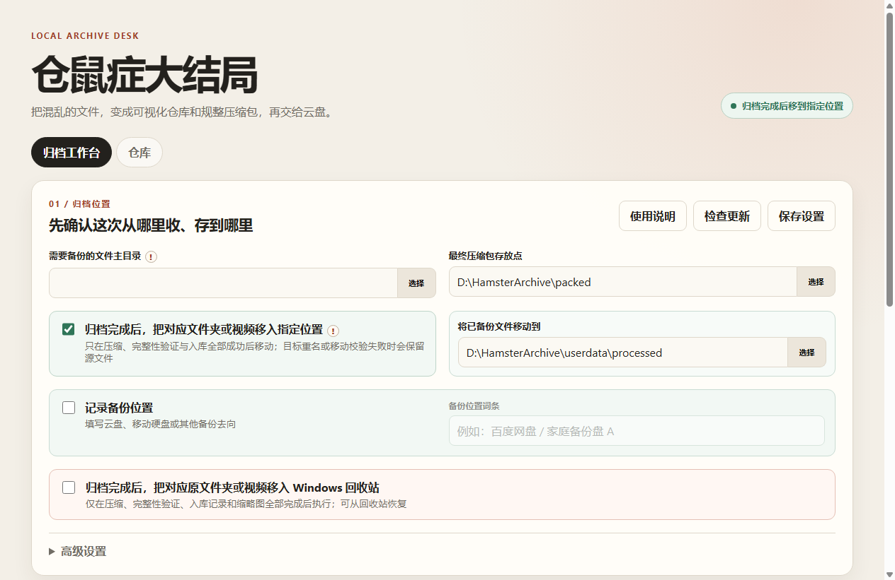
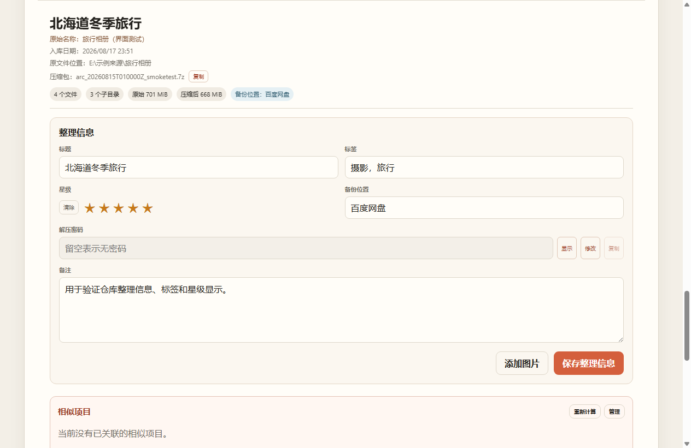

<div align="center">

# 🐹 仓鼠症大结局

### 把散乱的大文件变成可校验的压缩包，也变成能搜索、能预览的本地仓库

本地优先 · 批量归档 · 媒体预览 · 便携数据


[下载发行版](../../releases) · [报告问题](../../issues) · [参与贡献](CONTRIBUTING.md)

</div>

---

## 它解决什么问题

当下载目录里堆满以文件夹和视频为单位的资源时，普通压缩工具只能生成压缩包，却不会告诉你“里面是什么、放到了哪里、是否已经收过”。仓鼠症大结局把这几件事连成一条可核验的流程：

```text
扫描 → 清单与查重 → 7-Zip 压缩 → 完整性验证 → 建立仓库记录 → 后处理原文件
```

- 主目录中的每个一级文件夹或视频，分别成为一个任务；也可直接拖入单项。
- 生成目录清单、缩略图和媒体信息，随后用 SQLite 建立本地索引。
- 大任务自动按 10 GiB 分卷；密码、备份位置、标签、星级和备注可随项目记录。
- 疑似重复、大任务和体积异常会停下来等待人工确认。
- 只有压缩、验证和入库完成后，才会按设置保留、移动或回收原文件。



## 仓库不是一张压缩包清单

仓库提供封面浏览、活跃度统计和随机漫步。搜索覆盖标题、标签、备注、路径与文件名；列表分页，目录树按可视区域渲染，适合逐渐增长的库存。


<details>
<summary>查看更多界面</summary>

### 大缩略图浏览


### 项目整理与相似关系



</details>

> 截图使用虚构项目和 Pixabay 演示图片，不包含真实用户数据。图片来源：[Mountain Lake](https://pixabay.com/photos/mountain-lake-landscape-nature-9024209/)、[City Night](https://pixabay.com/photos/city-night-street-destination-6818066/) 与 [Hamster](https://pixabay.com/photos/hamster-pet-animal-cute-1772742/)，依 [Pixabay Content License](https://pixabay.com/service/license-summary/) 使用。

## 主要能力

### 安全归档

- 便携版 7-Zip 压缩与 `7z t` 完整性测试。
- 压缩前清单和源文件复核；无法读取的文件跳过并写入日志。
- 体积异常不自动入库，可确认保留或只删除异常成品。
- 多卷成品采用暂存隔离后的原子删除流程，避免只处理一部分分卷。
- 压缩前检查磁盘余量；跨盘移动采用复制、核验、再删除源文件。
- 队列支持暂停、完成当前项后暂停、定时运行和基于历史速度的剩余时间估算。

### 媒体与缩略图

- 便携版 FFmpeg 完成视频探测与均匀抽帧，无需 FFprobe。
- 视频帧数和单项目缩略图上限均可设置；竖屏画面完整保留。
- 同一视频的多帧预览会成组显示。
- 图片可放大、设为封面、删除，也可手动选择或粘贴补充图片。

### 搜索、重复与相似关系

- SQLite + FTS5 持久化索引，中文采用单字与 bigram 候选词，拉丁文字按词索引。
- 精确指纹、标题和视频大小参与重复提示；相似判断完全在本地完成。
- 相似关系可针对单个项目重新计算，也可手动解除；解除关系会双向保存。
- 相似度排除词表可自行维护，减少常见厂牌、编号前缀等噪声。

### 原文件位置追踪

- 每个项目保存独立的隐藏原始路径字段，旧记录缺少该字段时会安全补为空值。
- 未移动的项目显示原路径；已移动或进入回收站的项目显示当前状态。
- 应用会分批、低频粗略核验已移动或已回收的项目；预期位置不存在时标为“原文件已消失”，之后不再重复检查。
- 删除仓库记录时，可选择尝试把已移动或已回收的原文件复原到原始位置；复原失败不会继续删除记录和压缩包。

### 仓库整理

- 标题、标签、星级、备注、备份位置和项目级解压密码。
- 密码默认遮盖，只在主动显示后可查看或复制。
- 批量追加标签、批量修改备份位置、多选删除和最多十步撤回。
- 手动新增无压缩包的库存记录，以及仓库导出、并入外部仓库。

## 快速开始

### 直接使用发行版

1. 在 [Releases](../../releases) 下载 Windows x64 压缩包。
2. 完整解压后运行 `HamsterArchive.exe`。
3. 选择“需要备份的文件主目录”和“打包后文件存放点”，先扫描并确认任务，再开始压缩入库。

请保留发行包的目录结构，不要只复制 EXE。Electron 运行库、7-Zip、FFmpeg 与 `userdata` 都依赖相对位置。应用和数据盘整体换盘后，相对工具路径仍能自动定位。

### 从源码运行

环境：Windows、Node.js 22+、npm。

```powershell
git clone https://github.com/CarlosZ16420/hamster-archive-desktop.git
cd hamster-archive-desktop
npm install
npm run check
npm test
npm start
```

源代码仓库不会提交体积较大的 `ffmpeg.exe`。本地构建发行包前，请将 FFmpeg 放入 `tools/ffmpeg/`；7-Zip 已随源码提供。

## 便携数据布局

```text
HamsterArchive-v3.0.0-win-x64/
├─ HamsterArchive.exe
├─ tools/
│  ├─ 7zip/
│  └─ ffmpeg/
├─ resources/
└─ userdata/
   ├─ config/       # 设置与相似度排除词表
   ├─ warehouse/    # SQLite 仓库与缩略图
   ├─ logs/         # 运行日志
   ├─ processed/    # 默认的已备份原文件去向
   └─ electron/     # 本地界面缓存
```

压缩暂存目录默认建立在“打包后文件存放点”旁，例如 `D:\packed-staging`，以减少跨盘移动。待备份主目录和成品存放点由用户选择，不属于源码或用户数据库。

`userdata` 可能包含密码、文件路径、缩略图和仓库索引。它被 Git 忽略，也不会进入公开快照；迁移软件时应在应用退出后复制整个程序目录。

## 技术与边界

| 领域 | 实现 |
|---|---|
| 桌面端 | Electron 43、上下文隔离、sandbox、严格 CSP |
| 数据 | Node 内置 SQLite、WAL、事务、FTS5 |
| 压缩 | 7-Zip、10 GiB 分卷、可选密码、完整性测试 |
| 媒体 | 单个 FFmpeg 程序完成探测与抽帧 |
| 性能 | 仓库分页、目录虚拟化、持久化搜索与相似候选索引 |
| 隐私 | 用户数据留在本机；不上传仓库、媒体或密码 |

应用不会主动上传文件。只有在你点击“检查更新”或打开 GitHub 链接时，才会访问 GitHub；压缩包上传仍由你的云盘客户端或手动操作完成。

## 开发与贡献

提交前请运行：

```powershell
npm run check
npm test
npm run publish:check
```

不要提交 `userdata/`、数据库、日志、归档包、密码、真实媒体或个人绝对路径。详见 [CONTRIBUTING.md](CONTRIBUTING.md) 与 [SECURITY.md](SECURITY.md)。

本项目采用 [MIT License](LICENSE)。7-Zip 和 FFmpeg 分别遵循其随附许可证。

---

<div align="center">

欢迎试用、提交 Issue 或 Pull Request。你的反馈会帮助这个小工具变得更稳、更顺手。

[GitHub 仓库](https://github.com/CarlosZ16420/hamster-archive-desktop) · [欢迎反馈](https://github.com/CarlosZ16420/hamster-archive-desktop/issues)

</div>
